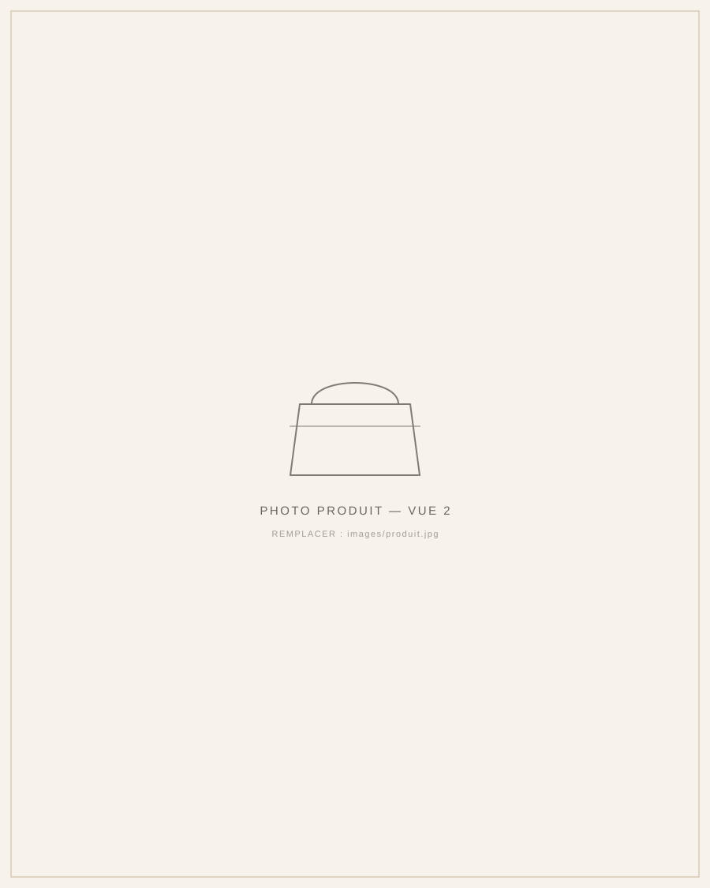
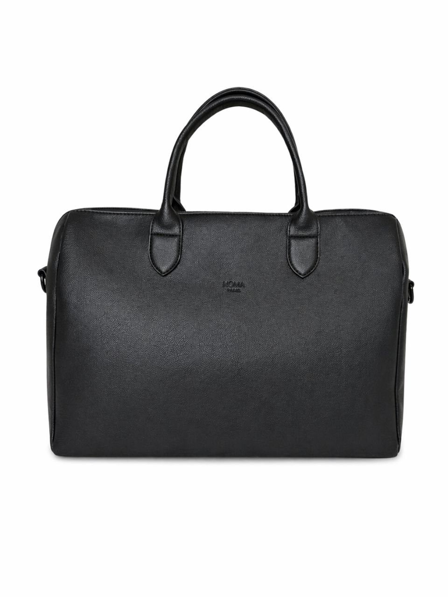

# NÔMA PARIS — Page vitrine

Page vitrine premium, statique (HTML/CSS/JS pur, sans build, sans dépendance,
sans base de données, sans paiement) présentant le sac NÔMA Paris.

## Structure des fichiers

```
noma-paris/
├── index.html          → toute la page
├── css/style.css        → tous les styles
├── js/main.js            → interactions légères (menu mobile, apparition au scroll)
└── images/
    ├── hero.jpg                 → grande photo du hero (photo réelle)
    ├── produit.svg               → photo de la fiche produit (sous le hero)
    ├── presentation.svg         → sac porté au quotidien
    ├── detail-interieur.svg     → gros plan intérieur / poches
    └── detail-matiere.svg       → gros plan matière / logo embossé
```

Les fichiers `.svg` restants sont volontairement des **placeholders** (fond
ivoire, icône de sac en ligne fine, légende indiquant quel visuel doit venir
ici) — aucune fausse photo n'a été générée. `hero.jpg` est la première vraie
photo intégrée au site.

## Prévisualiser la page en local

Pas besoin d'installation. Deux options :

**Option 1 — le plus simple**
Double-clique sur `index.html` (ou clic droit → Ouvrir avec ton navigateur).
La page s'ouvre directement.

**Option 2 — avec un petit serveur local** (recommandé si les polices Google
Fonts ne s'affichent pas correctement en ouverture directe) :

```bash
cd noma-paris
python3 -m http.server 8000
```

Puis ouvre `http://localhost:8000` dans ton navigateur.

## Remplacer une image par une vraie photo

1. Place ta photo dans le dossier `images/` (formats `.jpg`, `.jpeg`, `.webp`
   ou `.png`, idéalement 1200 px de large minimum).
2. Ouvre `index.html`, cherche la balise `` correspondante et remplace
   le nom de fichier `.svg` par le nom de ta photo.

Exemple pour l'image de la fiche produit :

```html
<!-- avant -->


<!-- après -->

```

Tableau de correspondance :

| Emplacement dans la page   | Fichier placeholder actuel      | Ratio conseillé |
|-----------------------------|----------------------------------|------------------|
| Hero (grande photo)         | `images/hero.jpg` ✅ déjà remplacée | paysage / large  |
| Fiche produit (sous le hero)| `images/produit.svg`             | portrait 4:5     |
| Présentation du sac         | `images/presentation.svg`        | portrait 4:5     |
| Détail — intérieur/poches   | `images/detail-interieur.svg`    | portrait 4:5     |
| Détail — matière/logo       | `images/detail-matiere.svg`      | portrait 4:5     |

Tu peux remplacer les images une par une, dans n'importe quel ordre — la
page reste fonctionnelle même si certaines sont encore en placeholder.

## Mettre la page en ligne gratuitement

Aucun abonnement nécessaire. Deux options 100 % gratuites, sans carte
bancaire :

### Option A — GitHub Pages (recommandé, le dépôt est déjà sur GitHub)

1. Dans le dépôt GitHub, va dans **Settings → Pages**.
2. Sous « Build and deployment », choisis la branche à publier (ex. `main`
   ou la branche courante) et le dossier `/ (root)`.
3. Clique sur **Save**. GitHub te donne une URL du type
   `https://<utilisateur>.github.io/<nom-du-repo>/` — utilisable
   immédiatement, gratuite, sans limite de temps.

### Option B — Netlify (glisser-déposer, encore plus simple)

1. Va sur [app.netlify.com/drop](https://app.netlify.com/drop) (compte
   gratuit, pas de carte bancaire requise).
2. Glisse le dossier `noma-paris` complet dans la fenêtre.
3. Netlify génère une URL publique immédiatement (ex.
   `https://noma-paris.netlify.app`), modifiable dans les réglages.

Les deux solutions sont gratuites à vie pour ce type de page (pas de
serveur, pas de base de données, pas de trafic e-commerce).

## Ce qui n'a volontairement pas été inclus

Conformément au brief : pas de panier, pas de paiement, pas de compte
client, pas de compte à rebours, pas de faux avis, pas de mention
« best-seller », pas de prix barré ni de fausse réduction. Le prix affiché
(139 €) est présenté partout comme le **prix public conseillé**.
